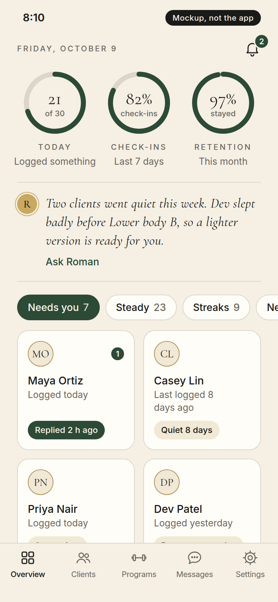
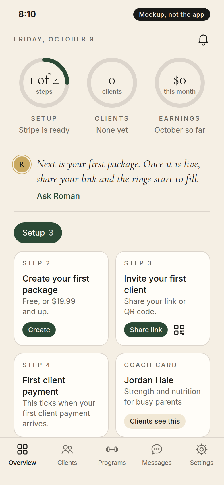
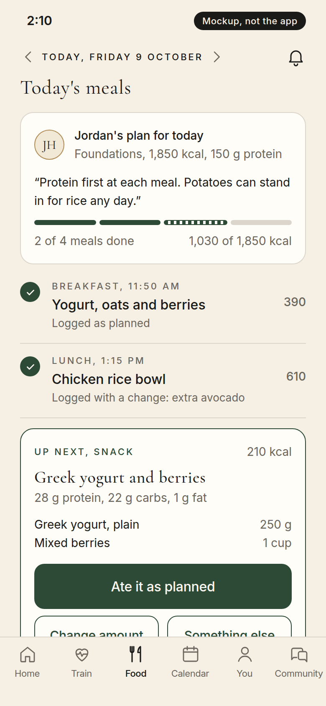
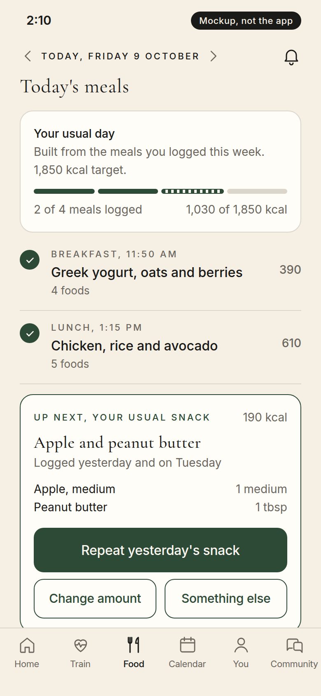
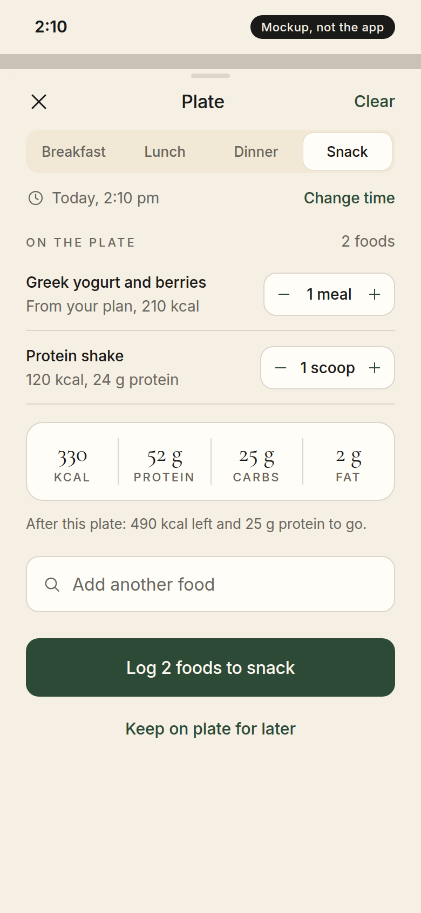
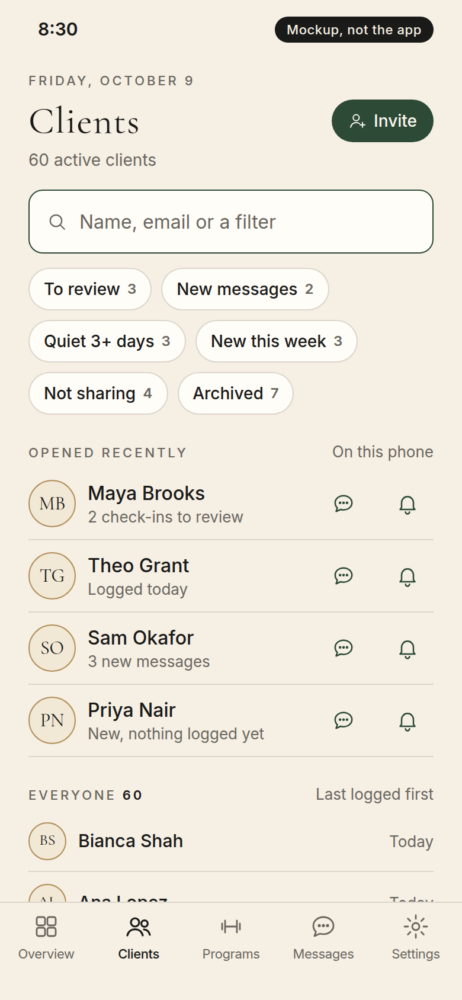
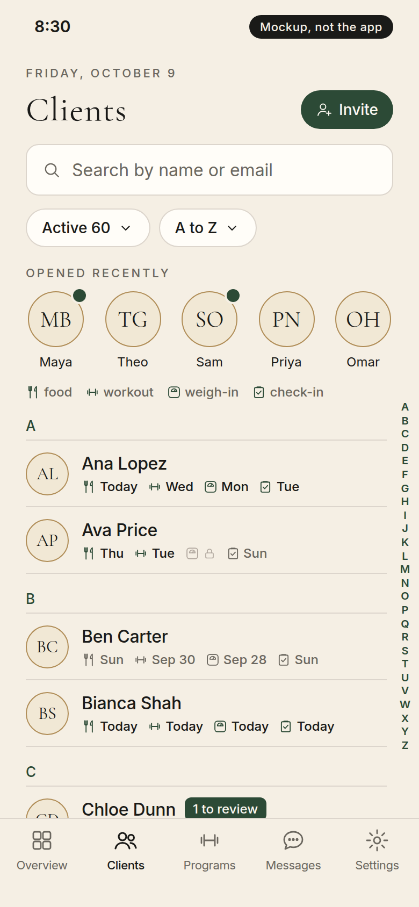
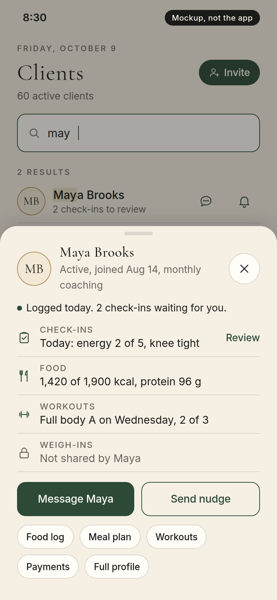
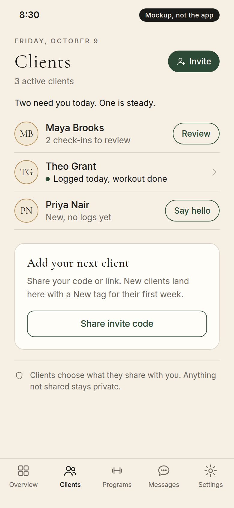

# v1.1 specs: UI

Owner-selected screen designs for v1.1. Each section is a spec for one screen, written from a design study (agent 135, 2026-10-09). Each section carries the selected mockup images and the exact HTML/CSS reference in planning/v1_1_ui/<section>/; build to match them exactly (owner, 2026-10-09: "put the mockup image inside the plans as well as an exact thing to copy"). Sample data in the mockups is fictional. Copy rules apply to every section: sentence case, no first person except Roman's own lines, no exclamation marks, no emojis, no clinic or partner names.

| Section | Screen | Status |
|---|---|---|
| UI-1 | Client Home: Rings and tiles | Selected by the owner 2026-10-09 |
| UI-2 | Coach Home: Roster rings and tiles, Roman's drafts, Money tab | Selected by the owner 2026-10-09 |
| UI-3 | Client food logging: Plan checklist, Your usual day, the plate | Selected by the owner 2026-10-09 |
| UI-4 | Coach client lookup: Search first with A to Z, peek sheet, Needs you under 15 | Selected by the owner 2026-10-09; the screens after the peek sheet still need design options |

---

## UI-1 Client Home: Rings and tiles

Owner, 2026-10-09 PDT (verbatim): "Of the screen mockups, the rings and tiles one looks amazing - add this to v1.1 specs under a new UI section please"

Source study: DESIGN-HOME-135 (three concepts: Day timeline, Rings and tiles, Coach letter and one next step).

### The mockup to copy

| Coached, first screen | Coachless, first screen |
|---|---|
|  |  |

| Coached, full scroll | Coachless, full scroll |
|---|---|
|  |  |

Exact reference: [coached.html](v1_1_ui/ui-1-client-home/coached.html) and [coachless.html](v1_1_ui/ui-1-client-home/coachless.html) (390 x 844 pt frame; open in a browser). Every size, color, radius and spacing in them comes from the app's theme tokens (src/theme), so a builder copies these values one to one:

- Colors: bone #F5EFE4 (background), surface #FFFDF8 (cards and tiles), cream #F1E8D5, ink #1A1A18, muted #6B675F, border #DCD5CC, forest #2C4A36 (primary, ring fill, the one filled button), on-forest #FBF7F0, gold #C9A961.
- Type: Cormorant Garamond for numbers and headings (h1 32/40, h2 24/30, h3 500 20/25; dial number 25/30; tile value 26/32; Roman's line italic 19/26); Inter for text (body 16/26, small 14/22, sub-lines 13/18, eyebrow 500 11/13 with 1.98 letter spacing, uppercase).
- Layout: side gutter 24; cards and tiles radius 16 with a 0.5 hairline border; tile grid two columns, gap 12, tile minimum height 118, padding 14; the filled forest button is 54 high, radius 12.
- Dials: three across, each 92 x 92, ring radius 40, stroke 7, track #DCD5CC, fill forest with round caps, starting at 12 o'clock; label 10 below the ring, sub-line 4 below the label.
- Tab bar: 83 high, labels 11/14; "Community" must fit at 360 pt.

Parity rule: every PR that builds this screen carries a parity table against these images and HTML, row by row.

### Inspiration
- Whoop: three dials at the top, tap a dial to go deeper ([WHOOP](https://www.whoop.com/us/en/thelocker/the-all-new-whoop-home-screen/)).
- Oura: score shortcuts first on Today ([Oura blog](https://ouraring.com/blog/new-oura-app-experience/)).
- Apple Health: the user picks the pinned categories ([Apple Support](https://support.apple.com/en-us/104997)).
- MacroFactor: dashboard tiles can be turned on or off and reordered ([MacroFactor](https://macrofactor.com/dashboard-customization/)).
- Gentler Streak: plain-language reading of your own numbers ([Gentler Streak docs](https://docs.gentler.app/understanding-your-activity-path/interpret-the-activity-path)).
- The app's own Health rings (ThreeRingHero, RecoveryRingHero).

### Layout, top to bottom
1. Header: coached shows "Message <coach first name>" with the unread count and the bell; coachless shows Roman locked ("Opens with a coach") and the bell.
2. Date line.
3. Three dials, each its own number, never a combined score:
   - Food: kcal left of the daily target, with eaten of target under it.
   - Train: workouts done of planned this week (coached: this week's coach assignments; coachless: the client's own "days per week" answer from the profile).
   - Sleep: percent recovered and hours asleep when Health is connected; otherwise the check-in's hours slept; with neither, an empty ring and a Connect prompt (never "coming soon").
4. Coachless only: the "Join a coach" banner right under the dials (same banner and session rule as m#654).
5. Roman's one-line read of the day (coached). Coachless: the Roman locked line ("Roman works with a coach ... Your own logging stays open.").
6. The day's one filled forest button (for example "Start Full Body A").
7. A two-column grid of tiles; each tile opens the screen that already exists for it: protein (with carbs and fat), water (with +8 oz), weight (30-day trend), fasting (last fast and when the window closes), habits, steps (Health), check-in, logging streak, and the next Calendar session (coached; coachless shows the logging streak instead).
8. "Edit tiles" at the foot: turn tiles on or off and reorder; the order is saved on the device.
9. One notice slot that shows a single notice at a time instead of a stack, in this order: dunning, pending invite, finish your profile, push permission, then the rest.

### Data
- Available today: food targets and totals, protein and macros, water, weight trend, fasting, habits, check-in, logging streak, Calendar sessions, steps and recovery (Health connected only).
- Needs new data: Roman's daily line on Home (default for v1.1: reuse the existing holistic insight sentence, no new AI call per Home view; owner decision open), and the saved tile order (device storage).

### What it takes to build
- A dial row that reuses the existing ring components.
- A tile grid component; each tile routes to its existing screen.
- An "Edit tiles" sheet and device-stored order.
- The Sleep dial fallback rule above.
- Re-point the tutorial spotlights (the daily targets beat moves to the Food dial).
- Rough size: medium, about 2 weeks; a few days more if Roman's line becomes a real AI call.

### Acceptance
- Coached and coachless variants both render at 360 pt wide without clipping, at default and large text.
- Every dial and tile opens a real screen; no dead tiles.
- Coachless: Join a coach banner present every session, Roman shown locked, basic logging tiles all work.
- Parity table against the selected mockup in each PR body; no device claim without a device.

---

## UI-2 Coach Home: Roster rings and tiles

Owner, 2026-10-09 PDT (verbatim): "Coach home 30 clients - I like that roman is offering help, but he needs to lead into "Approve Roman's drafts ->" where he has already drafted message responses, workout adjustments, ect. - for themality, I like render 2 - but we should also have the money+biz combination pages as a tab at the bottom - icon $ + "Money""

Source study: DESIGN-COACHHOME-135, concept 2 (Roster rings and tiles). Same dials and tiles as UI-1, so coach and client Home feel like one product.

### The mockup to copy

| Busy coach, 30 clients | New coach, zero clients |
|---|---|
|  |  |

Full scroll: [30 clients](v1_1_ui/ui-2-coach-home/busy-30-clients-full.png), [zero clients](v1_1_ui/ui-2-coach-home/new-coach-zero-clients-full.png). Exact HTML/CSS: [busy-30-clients.html](v1_1_ui/ui-2-coach-home/busy-30-clients.html), [new-coach-zero-clients.html](v1_1_ui/ui-2-coach-home/new-coach-zero-clients.html). Tokens as in UI-1.

### Changes the owner asked for on top of the mockup
1. Roman's line leads into one action: "Approve Roman's drafts ->". It opens a queue of work Roman has already prepared for the coach to approve, edit or reject: drafted message replies, workout adjustments, and the other drafts Roman makes today (coach AI drafts, meal plan changes). The line under the dials says what is waiting (for example "3 replies and 2 workout changes are ready for you"), and the button shows the count. Nothing is sent or changed until the coach approves.
2. A new bottom tab, "Money", with a $ icon. It combines the money pages and the business pages (earnings, payouts, packages, client payments and dunning, Stripe status, business settings) in one place. The tab bar keeps every label readable at 360 pt.

### Needs new data
- One count of Roman's pending drafts per type for the button and line (the coach AI draft routes exist; the Home summary needs the counts).

## UI-3 Client food logging

Owner, 2026-10-09 PDT (verbatim): "Client food logger - coached planned foods - render 2 is my chocie / Client food logging - coachless - concept 2 / add-food step - concept 1"

Source study: DESIGN-FOOD-135.

### The mockups to copy

| Coached: Plan checklist (concept 2) | Coachless: Your usual day (concept 2) | Add food: the plate (concept 1) |
|---|---|---|
|  |  |  |

Full scroll: [coached](v1_1_ui/ui-3-food-logging/coached-plan-checklist-full.png), [coachless](v1_1_ui/ui-3-food-logging/coachless-usual-day-full.png), [add food](v1_1_ui/ui-3-food-logging/add-food-plate-full.png). Exact HTML/CSS: [coached](v1_1_ui/ui-3-food-logging/coached-plan-checklist.html), [coachless](v1_1_ui/ui-3-food-logging/coachless-usual-day.html), [add food](v1_1_ui/ui-3-food-logging/add-food-plate.html).

### What it is
- Coached: the coach's meals for the day are ticked off in order. "Ate it as planned" logs the planned meal in one tap; "Change amount" and "Something else" cover the rest.
- Coachless: "Your usual day", built from the meals the client repeats, works the same way.
- Adding food goes through the plate: pick several foods, set portions, choose the meal and time, and log them together.
- Basic self logging stays open in every state, including the Day-10 lockout.

### Needs new data
- "Your usual day" needs the client's repeated meals grouped by meal slot (from their own log history).
- The coach-allowed swaps list under "Something else" is new data; until it exists, show recent foods and search.

## UI-4 Coach client lookup

Owner, 2026-10-09 PDT (verbatim): "Coach client lookup - 60 clients - concept 3 but make sure to still use concept 2's alphabetical sorting UI under the recently opened profiles / Coach client look - doesnt share weight logs - I like the peek sheet, then we need to have an agent spec out the UI desing optiosn for what happens after you click food logs or workouts or payments, ect. / coach client lockup - less than 15 clients - I like mockup 1 for anyone under 15 clients!"

Source study: DESIGN-LOOKUP-135.

### The mockups to copy

| 15 or more clients: Search first (concept 3) | A to Z index to add under "Opened recently" (concept 2) |
|---|---|
|  |  |

| Client detail: the peek sheet (concept 3) | Under 15 clients: Needs you (concept 1) |
|---|---|
|  |  |

Full scroll: [search first](v1_1_ui/ui-4-client-lookup/list-15-plus-search-first-full.png), [A to Z](v1_1_ui/ui-4-client-lookup/a-to-z-index-reference-full.png), [peek sheet](v1_1_ui/ui-4-client-lookup/client-peek-sheet-full.png), [under 15](v1_1_ui/ui-4-client-lookup/list-under-15-needs-you-full.png). Exact HTML/CSS: [search first](v1_1_ui/ui-4-client-lookup/list-15-plus-search-first.html), [A to Z](v1_1_ui/ui-4-client-lookup/a-to-z-index-reference.html), [peek sheet](v1_1_ui/ui-4-client-lookup/client-peek-sheet.html), [under 15](v1_1_ui/ui-4-client-lookup/list-under-15-needs-you.html).

### Rules
- Under 15 active clients: the Needs you layout (concept 1), clients grouped by what they need with Review, Reply or Nudge on each row.
- 15 or more: the Search first layout (concept 3), search box and filter chips on top, then "Opened recently", then the full list with concept 2's A to Z sorting and side index under it.
- Tapping a client opens the peek sheet (concept 3) over the list. Data the client does not share shows "Not shared by <first name>", never an empty value.

### Still to design
- What opens after the peek sheet's Food log, Workouts, Payments and the other buttons. The owner asked for a design run with options for each of those screens; they get their own section here once picked.

